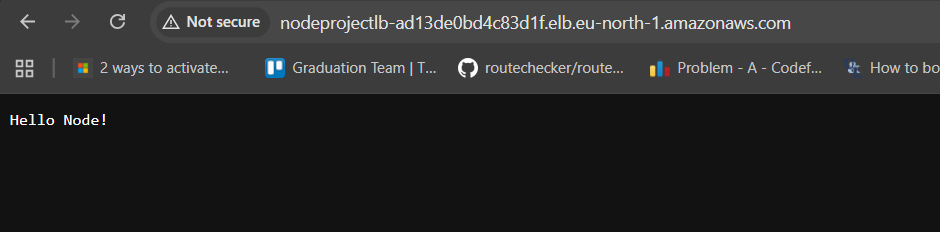

# Node Hello World

Simple node.js app that servers "hello world"

Great for testing simple deployments to the cloud

## Run It

the CI pipeline consists of 2 main jobs :

- build-push :
  1. check out the code and lints it and push fixes back to the repo
  2. the commit tag is fetched and added as image tag
  3. the docker image is built and pushed to dockerhub
  4. credentials regarding the registry stored as secrets in `local` environment
  5. the build of the image includes newrelic to add monitoring layer
- deploy :
  1. run terraform that creates the following resources :-

     * Security group
     * ECS task - ECS service 
     * NLB --> access the website publicly
     
     \_

Area Of improvments :

- NR lisence key as a secret
- commit tag to fetch the new commit
