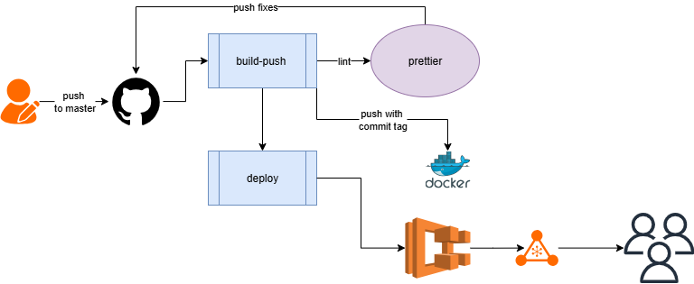

# Node Hello World

Simple node.js app that servers "hello world"

Great for testing simple deployments to the cloud

## Run It

the CI pipeline consists of 2 main jobs :

- build-push : 1. check out the code and lints it and inntiate a second commit to the repo 2. the new commit tag is fetched and added as image tag
- deploy : 1. run terraform that creates the following resources
  _ Security group
  _ ECS task - ECS service
  _ NLB --> access the website publicly
  _
  `npm start`
